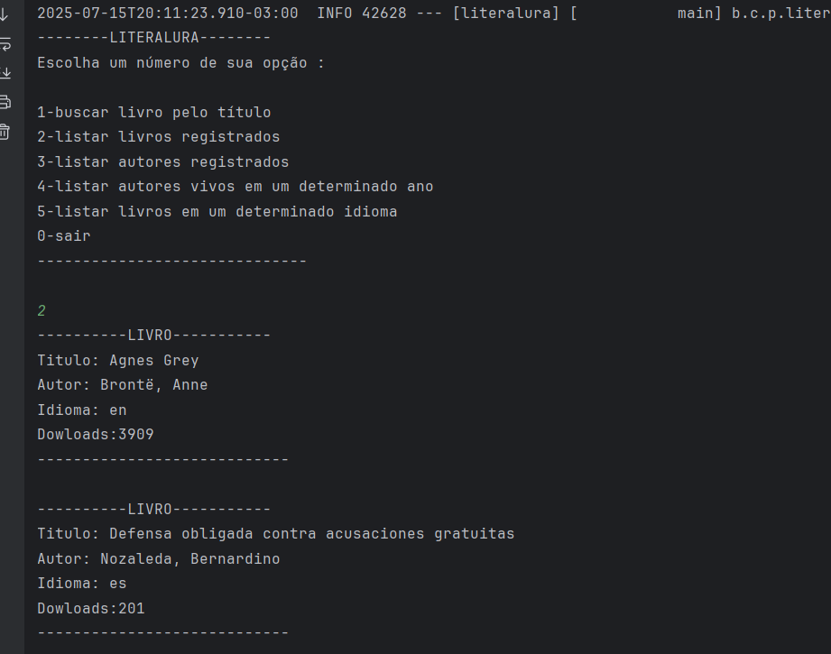

# Literalura Challenge
Este projeto é um desafio de programação proposto
pela Alura, focado na criação de uma aplicação Java 
com Spring Boot para interagir com a API Gutendex. 
A aplicação permite buscar livros por título, 
persistir os dados em um banco de dados PostgreSQL, e realizar diversas consultas sobre livros e autores.

## 🚀 Tecnologias Utilizadas
* Spring Boot: Framework para facilitar a criação de aplicações Java stand-alone.

* Maven: Ferramenta de automação de build e gerenciamento de dependências.

* PostgreSQL: Sistema de gerenciamento de banco de dados relacional.

* Spring Data JPA: Abstração para acesso a dados, facilitando a interação com o banco de dados.

* Jackson (ObjectMapper): Biblioteca para serialização/desserialização de JSON, utilizada para mapear os dados da API Gutendex para objetos Java.

